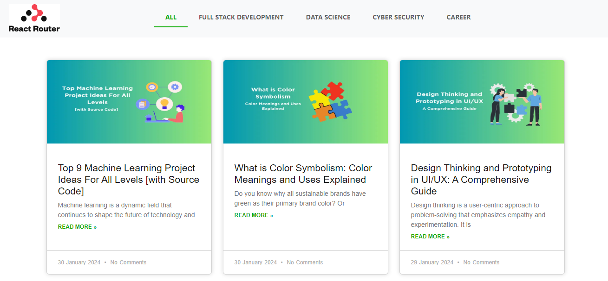

# React-Router-Task

This is an exercise website which is based on react router which was designed by me using React. It's Guvi-Zen class Roadmap session: Day-26 and React : Day-6 Task.

## Tech Stack

- HTML
- CSS
- Javascript
- Bootstrap
- React

## Features

- Responsive and attractive Design

## Lessons Learned

<b>Routing in React</b>: 
- I Understand how React Router works to manage navigation within a React application.
- <Link> and <NavLink> Components: Learn how to use these components to create navigational links within your React components.
<b>Dynamic Routing</b>: 
- Explore dynamic routing and how to handle parameters in route paths.

## Website

[React-Router-Task](https://vijay-react-router-task.netlify.app/)

## Screenshots

## React + Vite

This template provides a minimal setup to get React working in Vite with HMR and some ESLint rules.

Currently, two official plugins are available:

- [@vitejs/plugin-react](https://github.com/vitejs/vite-plugin-react/blob/main/packages/plugin-react/README.md) uses [Babel](https://babeljs.io/) for Fast Refresh
- [@vitejs/plugin-react-swc](https://github.com/vitejs/vite-plugin-react-swc) uses [SWC](https://swc.rs/) for Fast Refresh

## Setup

Followig are the requirements to run this project:
- vite --> React Project Build Tool
- Node Package Manager (NPM)
- React

## npm run dev

Runs the app in the development mode.\
Open [http://localhost:5173](http://localhost:5173) to view it in your browser.

The page will reload when you make changes.\
You may also see any lint errors in the console.

## Feedback

If you have any feedback, please reach out to me at vijaymayhul@gmail.com

